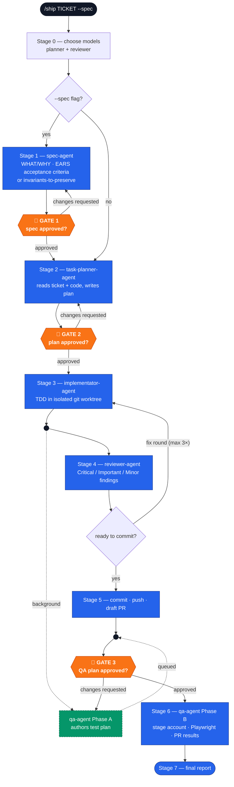

# Ship

AI orchestrator to deliver product features end-to-end, from a Jira ticket to a
reviewed, QA'd pull request.

```
/ship <TICKET> [stage] [model] [--spec]
```

## How it works



Only three stops need a human: the spec (when `--spec` is used), the plan, and the QA
plan. Everything else — the review⇄fix loop, the parallel QA-plan authoring, the
commit/push/PR — runs on its own.

Five agents, three human gates:

- **spec-agent** (optional, `--spec`) — turns the ticket into a reviewed spec: user
  stories, EARS-format acceptance criteria, or an "Invariants to preserve" section for
  refactor/migration tickets. No codebase access.
- **task-planner-agent** — turns the ticket (or the approved spec) into a reviewed
  implementation plan, grounded in the real codebase.
- **implementator-agent** — implements the approved plan with TDD in an isolated git
  worktree.
- **reviewer-agent** — reviews the uncommitted diff (correctness, security, spec
  compliance) and returns a fix-or-approve verdict; the review⇄fix loop runs
  autonomously up to 3 rounds.
- **qa-agent** — plans and executes an end-to-end browser QA pass, then posts the plan
  and results to the PR.

Plus **`workflow-retro`** (`/workflow-retro`, manual-only) — a read-only observer that
reviews a completed `/ship` run afterward: real per-agent token spend, what went well
or poorly, and improvement suggestions. Not a pipeline stage, no handoff contract with
`ship`.

## Install

### Claude Code
```
/plugin marketplace add eugenegodun/ship
/plugin install ship@ship
```

### Cursor
Cursor Settings → Plugins → add marketplace `eugenegodun/ship` → install **Ship**.

### Codex
Clone this repo, then in Codex: `/plugins` → browse **Ship** → install.

## Versioning

Two independent version axes:

- **Per-agent versions** — each agent's own SemVer, in its frontmatter `version:` and
  tracked in [`plugins/ship/agents/CHANGELOG.md`](plugins/ship/agents/CHANGELOG.md).
  These track behavior changes to the pipeline itself (gate structure, agent
  handoffs, etc).
- **Plugin package version** — the installable package version, in each tool's
  manifest (`plugins/ship/.claude-plugin/plugin.json`, `.cursor-plugin/plugin.json`,
  `.codex-plugin/plugin.json`) and the root marketplace indexes. Bump all of these
  together on every release — there's no sync script, this is a single-plugin repo.

## License

MIT — see [LICENSE](LICENSE).
