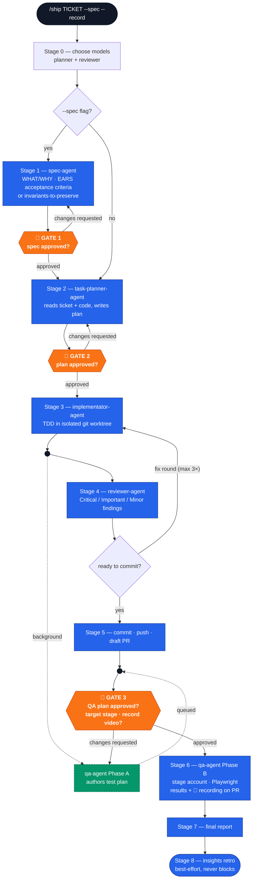

# Ship

AI orchestrator to deliver product features end-to-end, from a Jira ticket to a
reviewed, QA'd pull request.

```
/ship <TICKET> [--spec] [--record]
```

- `--spec` — write a reviewed spec (WHAT/WHY) before planning the HOW.
- `--record` — record the QA browser session as video, uploaded and linked on the PR.
  Without the flag you're asked at the QA gate.

The ticket key is the only required input. There is no stage or model parameter: models
are chosen at startup, and the QA target stage is named in your QA-plan approval — a PR's
ephemeral stage doesn't exist until its draft PR and `/dynamic` environment are up.

## How it works



Only three stops need a human: the spec (when `--spec` is used), the plan, and the QA
plan. Everything else — the review⇄fix loop, the parallel QA-plan authoring, the
commit/push/PR, the insights retro — runs on its own.

Five agents (four without `--spec`), three human gates:

- **spec-agent** (optional, `--spec`) — turns the ticket into a reviewed spec: user
  stories, EARS-format acceptance criteria, or an "Invariants to preserve" section for
  refactor/migration tickets. No codebase access.
- **task-planner-agent** — turns the ticket (or the approved spec) into a reviewed
  implementation plan, grounded in the real codebase.
- **implementator-agent** — implements the approved plan with TDD in an isolated git
  worktree.
- **reviewer-agent** — reviews the uncommitted diff (correctness, security, spec
  compliance) and returns a fix-or-approve verdict; the review⇄fix loop runs
  autonomously up to 3 rounds.
- **qa-agent** — plans an end-to-end browser QA pass, then (after your approval) provisions
  a disposable stage account, enables any required feature flags, drives Playwright, and
  posts the PASS/FAIL results to the PR. The plan itself is shown to you at the gate, not
  posted. Its target stage arrives with your approval, and — when recording is on — it
  captures each browser session, uploads the video, and links it under the verdict.

Two bundled skills run alongside the pipeline:

- **`engineering-insights`** — invoked automatically at Stage 8 to capture non-obvious
  lessons from the run (pipeline friction, and project gotchas when the ticket touched
  `edu-frontend/`). Best-effort: a skip or failure never affects the shipped PR.
- **`workflow-retro`** (`/workflow-retro`, manual-only) — a read-only observer that
  reviews a completed `/ship` run afterward: real per-agent token spend, what went well
  or poorly, and improvement suggestions. Not a pipeline stage, no handoff contract with
  `ship`.

## QA video recording

Pass `--record`, or answer "Yes" when asked at the QA gate. During Phase B the qa-agent
records each browser instance with `playwright-cli`, annotates the actions on screen, and
marks one chapter per test case using the approved plan's case ids. The video is uploaded
to internal static hosting and linked as `🎥 QA recording: <URL>` under the verdict line in
both the PR comment and the final report. Recording is best-effort end to end — if capture
or upload fails, the run still passes and the local file path is reported instead.

## Evals

The pipeline's contracts are tested by a [deepeval](https://deepeval.com) suite in
[`evals/`](evals/) — 42 cases in four tiers, run on GitHub Actions for every PR that
touches `plugins/ship/**` or `evals/**`:

| Tier | Cases | What it checks |
|------|-------|----------------|
| Unit | 11 | The harness itself — artifact loading, tool schemas, the turn simulator. No model calls. |
| Agent-level | 6 | Each agent's own `.md` against fixture inputs, LLM-judged: EARS specs, plan grounding, seeded-bug detection, QA plan quality. |
| Decision points | 20 | `ship/SKILL.md` given a mid-pipeline transcript → assert its next move: gate discipline, resume-vs-respawn, the 3-round cap, model escalation, the parallel QA branch, no fabricated token counts. |
| End-to-end | 5 | The orchestrator played multi-turn with stubbed subagents — dispatch order, gate stops, halt behavior. Nightly, non-blocking. |

Generation runs on Claude, judging on OpenAI (a different family, to blunt
self-preference). See [`evals/README.md`](evals/README.md) to run them locally or add a
case. This suite is not decorative: `ship` 4.0.0 (the removed `[model]`/`[stage]` params)
and `qa-agent` 3.0.0 came directly out of contract gaps its first live runs exposed.

## Install

### Claude Code
```
/plugin marketplace add eugenegodun/ship
/plugin install ship@ship
```

### Cursor
Cursor Settings → Plugins → add marketplace `eugenegodun/ship` → install **Ship**.

### Codex
Add the marketplace and install **Ship** from `/plugins` as usual, then install the pipeline's
agent roles — Codex plugins cannot bundle them, so this is a one-time copy into `~/.codex/agents/`:

```
bash "$(ls -d ~/.codex/plugins/cache/ship/ship/*/ | sort -V | tail -1)scripts/install-codex-agents.sh"
```

Restart the Codex session, then invoke the skill with a ticket as in Claude Code. Differences on
Codex: there are no Stage 0 model questions (models are fixed per role in
`plugins/ship/codex-agents/*.toml` — planner and reviewer `gpt-5.6 xhigh`, implementator
`gpt-5.6 high`, QA `gpt-5.6 medium`, git ops `gpt-5.6-terra`), the three gates are plain prose
questions, and the reviewer model-escalation step is a no-op. Re-run the install script after every
plugin update (`--check` tells you whether you need to). The full mapping lives in
[`plugins/ship/skills/ship/references/codex-dispatch.md`](plugins/ship/skills/ship/references/codex-dispatch.md);
the role files are generated from `agents/*.md` by `plugins/ship/scripts/sync_codex_agents.py`, and
CI fails if they drift.

## Versioning

Two independent version axes:

- **Per-component versions** — each agent's and skill's own SemVer, in its frontmatter
  `version:` and tracked in
  [`plugins/ship/agents/CHANGELOG.md`](plugins/ship/agents/CHANGELOG.md). These track
  behavior changes to the pipeline itself (gate structure, agent handoffs, etc). The
  `ship` orchestrator owns the contract: its MAJOR bumps whenever an inter-stage handoff
  or invocation input changes. Current: `ship` 4.2.0, `qa-agent` 3.1.0,
  `task-planner-agent` 2.1.0, `implementator-agent` 1.3.0, `reviewer-agent` 1.2.1,
  `spec-agent` 1.2.0.
- **Plugin package version** — the installable package version, in each tool's
  manifest (`plugins/ship/.claude-plugin/plugin.json`, `.cursor-plugin/plugin.json`,
  `.codex-plugin/plugin.json`) and the root marketplace indexes. Bump all of these
  together on every release — there's no sync script, this is a single-plugin repo.

## License

MIT — see [LICENSE](LICENSE).
