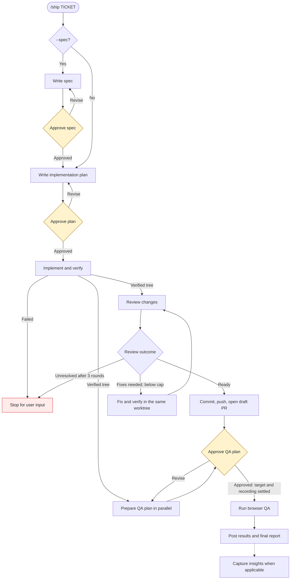

# Ship

AI orchestrator to deliver product features end-to-end, from a Jira ticket to a
reviewed, QA'd pull request.

```
/ship <TICKET> [--spec] [--record]
```

- `--spec` — write a reviewed spec (WHAT/WHY) before planning the HOW.
- `--record` — record the QA browser session as video, uploaded and linked on the PR.
  Without the flag you're asked at the QA gate.

The ticket key is the only required input. There is no stage or model parameter. Claude
Code asks you to choose planner and reviewer models at startup; Codex uses fixed models
per role. Name the QA target stage in your QA-plan approval, once the draft PR and its
`/dynamic` environment are available. Without a named stage, QA browses
`http://localhost:3000`, backed by `stage40`; a named stage uses that stage's real host
for both the browser and fixtures.

## How it works



The normal flow has **two approval gates**, or **three with `--spec`**: the optional
spec, the implementation plan, and the QA plan. Claude Code also asks for model choices
at startup. Implementation failures, unresolved findings after three review rounds, or
other blockers can require additional user input.

QA planning starts after the **first verified working tree**, alongside review and PR
creation. Its plan is shown for approval only when both the plan and draft PR are ready.
Fix rounds reuse the implementator's worktree and do not launch another QA agent. The
full contract lives in the [orchestrator skill](plugins/ship/skills/ship/SKILL.md).

The pipeline uses four core agents, an optional spec agent, and a git agent:

- **spec-agent** (optional, `--spec`) — turns the ticket into a reviewed spec: user
  stories, EARS-format acceptance criteria, or an "Invariants to preserve" section for
  refactor/migration tickets. No codebase access.
- **task-planner-agent** — turns the ticket (or the approved spec) into a reviewed
  implementation plan, grounded in the real codebase.
- **implementator-agent** — implements the approved plan with TDD in an isolated git
  worktree.
- **reviewer-agent** — reviews the uncommitted diff (correctness, security, spec
  compliance) and returns a fix-or-approve verdict; the review⇄fix loop runs
  autonomously up to 3 rounds.
- **git agent** — commits the verified worktree, pushes the ticket branch, and opens a
  draft PR using the repository template. Claude Code uses a Haiku agent; Codex uses
  `ship-git-agent`.
- **qa-agent** — plans an end-to-end browser QA pass, then (after your approval) provisions
  a disposable stage account, enables any required feature flags, drives Playwright, and
  posts the PASS/FAIL results to the PR. The plan itself is shown to you at the gate, not
  posted. Its target stage arrives with your approval, and — when recording is on — it
  captures each browser session, uploads the video, and links it under the verdict.

Two bundled skills run alongside the pipeline:

- **`engineering-insights`** — invoked automatically at Stage 8 to capture non-obvious
  lessons from the run (pipeline friction, and project gotchas when the ticket touched
  `edu-frontend/`). Set `SHIP_REPO_PATH` to an existing local Ship clone to capture
  pipeline lessons in its `INSIGHTS.md`; that call is skipped when the variable is unset
  or the directory is missing. Project lessons go into the implementation worktree's
  `edu-frontend/INSIGHTS.md` when that project was touched. Both calls commit locally
  without pushing. Best-effort: a skip or failure never affects the shipped PR.
- **`workflow-retro`** (`/workflow-retro`, manual-only) — a read-only observer that
  reviews a completed `/ship` run afterward: real per-agent token spend, what went well
  or poorly, and improvement suggestions. Its analyzer currently reads Claude Code
  transcripts under `~/.claude/projects/`; it does not analyze Codex transcripts. It is
  not a pipeline stage. See the [retrospective skill](plugins/ship/skills/workflow-retro/SKILL.md).

## QA video recording

Pass `--record`, or answer "Yes" when asked at the QA gate. During Phase B the qa-agent
records each browser instance with `playwright-cli`, annotates the actions on screen, and
marks one chapter per test case using the approved plan's case ids. The video is uploaded
to internal static hosting and linked as `🎥 QA recording: <URL>` under the verdict line in
both the PR comment and the final report. Recording is best-effort: capture or upload
failures do not change the QA verdict. If capture fails, QA continues without a recording;
if upload fails after a recording was captured, the local file path is reported instead.
See the [QA agent](plugins/ship/agents/qa-agent.md) for the execution and reporting contract.

## Evals

The pipeline's contracts are tested by a [deepeval](https://deepeval.com) suite in
[`evals/`](evals/) — 95 cases in five tiers. GitHub Actions runs the first four tiers on
PRs touching `plugins/ship/**` or `evals/**`; end-to-end cases run nightly or manually:

| Tier | Cases | What it checks |
|------|-------|----------------|
| Unit | 43 | The harness itself — artifact loading, tool schemas, the turn simulator, the Codex role generator/installer, and version invariants. No model calls. |
| Agent-level | 6 | Each agent's own `.md` against fixture inputs, LLM-judged: EARS specs, plan grounding, seeded-bug detection, QA plan quality. |
| Decision points | 20 | `ship/SKILL.md` given a mid-pipeline transcript → assert its next move: gate discipline, resume-vs-respawn, the 3-round cap, model escalation, the parallel QA branch, no fabricated token counts. |
| Codex | 21 | OpenAI decision points plus asynchronous continuation and generated-role completion scenarios, with simulated child tools and no user nudges. |
| End-to-end | 5 | The orchestrator played multi-turn with stubbed subagents — dispatch order, gate stops, halt behavior. Nightly, non-blocking. |

Claude generates the agent-level, decision-point, and end-to-end responses. OpenAI
generates the Codex-tier responses and judges the agent-level evaluations, using a
different model family from their generator to reduce self-preference. See
[`evals/README.md`](evals/README.md) to run them locally or add a case. This suite is not
decorative: `ship` 4.0.0 (the removed `[model]`/`[stage]` params)
and `qa-agent` 3.0.0 came directly out of contract gaps its first live runs exposed.

## Install

### Claude Code

```
/plugin marketplace add eugenegodun/ship
/plugin install ship@ship
```

### Cursor

Cursor Settings → Plugins → add marketplace `eugenegodun/ship` → install **Ship**.

### Codex

Add the marketplace and install **Ship** from `/plugins` as usual, then install the pipeline's
agent roles — this plugin supplies an installer that copies them into
`${CODEX_HOME:-$HOME/.codex}/agents/` (normally `~/.codex/agents/`):

```
bash "$(ls -d ~/.codex/plugins/cache/ship/ship/*/ | sort -V | tail -1)scripts/install-codex-agents.sh"
```

Restart the Codex session, then invoke the skill with a ticket as in Claude Code. Differences on
Codex: there are no Stage 0 model questions (models are fixed per role in
`plugins/ship/codex-agents/*.toml` — spec, planner, and reviewer `gpt-5.6-sol xhigh`, implementator and QA
`gpt-5.6-terra` (`high`/`medium`), git ops `gpt-5.6-luna low`), the approval gates are plain prose
questions, and the reviewer model-escalation step is a no-op. `reviewer-agent`'s `code-review` and
`security-review` skills are Claude Code built-ins that don't exist on Codex, so the Codex reviewer
runs its own diff review + static checks only. Codex sandboxes also block network by default; the
planner/spec, git, and qa roles need it, so set `network_access = true` under
`[sandbox_workspace_write]` in `~/.codex/config.toml` (or run under an approval policy that lets
subagents request escalation) before your first `/ship` run. Re-run the install script after every
plugin update (`--check` tells you whether you need to). The full mapping lives in
[`plugins/ship/skills/ship/references/codex-dispatch.md`](plugins/ship/skills/ship/references/codex-dispatch.md);
five role files are generated from unchanged `agents/*.md` sources plus optional
Codex-only `codex-agents/overlays/<agent>.md` instructions by
[`sync_codex_agents.py`](plugins/ship/scripts/sync_codex_agents.py), and CI fails if they drift.
The sixth, [`ship-git-agent.toml`](plugins/ship/codex-agents/ship-git-agent.toml), is handwritten.

Codex keeps the parent active after dispatching work, resumes partial implementation results, and
advances finished fixes to re-review. Progress updates do not end the run; final responses are for
approval gates, explicit stops, evidenced blockers, or completion. These are prompt instructions,
not a background scheduler: app shutdowns and runtime interruptions can still require recovery.
Claude's shared skill and agent instructions are unchanged.

After updating the plugin, reinstall the roles and start a fresh session. If your invocation uses
a local copy such as `~/.codex/skills/ship/SKILL.md`, verify that its adjacent
`references/codex-dispatch.md` matches the updated plugin too; a cache update alone may not update
that copy. The role installer's `--check` verifies roles, not copied skill references.

If git operations encounter a detached HEAD in an App-managed worktree that the agent
cannot branch from, the pipeline reports the App's **Create branch** handoff and waits
for you to provide the PR before QA proceeds.

## Versioning

Two independent version axes:

- **Per-component versions** — each agent's and skill's own SemVer, in its frontmatter
  `version:` and tracked in
  [`plugins/ship/agents/CHANGELOG.md`](plugins/ship/agents/CHANGELOG.md). These track
  behavior changes to the pipeline itself (gate structure, agent handoffs, etc). The
  `ship` orchestrator owns the contract: its MAJOR bumps whenever an inter-stage handoff
  or invocation input changes. Current: `ship` 4.2.1, `qa-agent` 3.1.1,
  `task-planner-agent` 2.1.1, `implementator-agent` 1.3.2, `reviewer-agent` 1.2.2,
  `spec-agent` 1.2.0.
- **Plugin package version** — the installable package version, in each tool's
  manifest (`plugins/ship/.claude-plugin/plugin.json`, `.cursor-plugin/plugin.json`,
  `.codex-plugin/plugin.json`) and the root marketplace indexes. Bump all of these
  together on every release — there's no sync script, this is a single-plugin repo.

## License

MIT — see [LICENSE](LICENSE).
